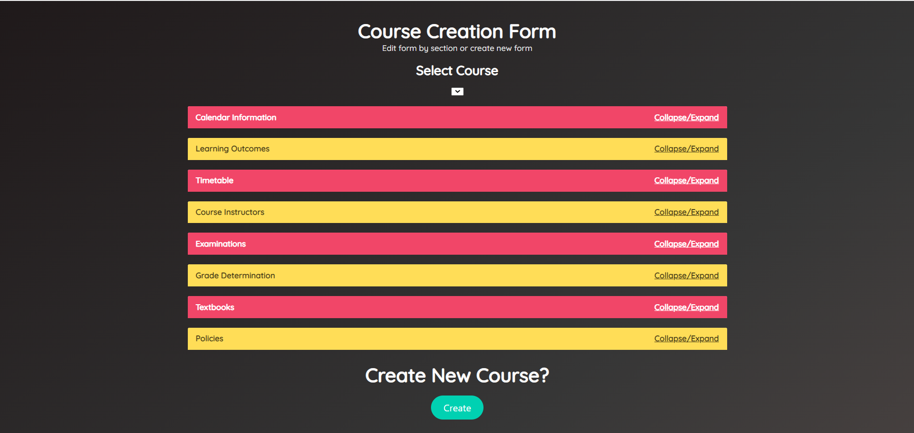
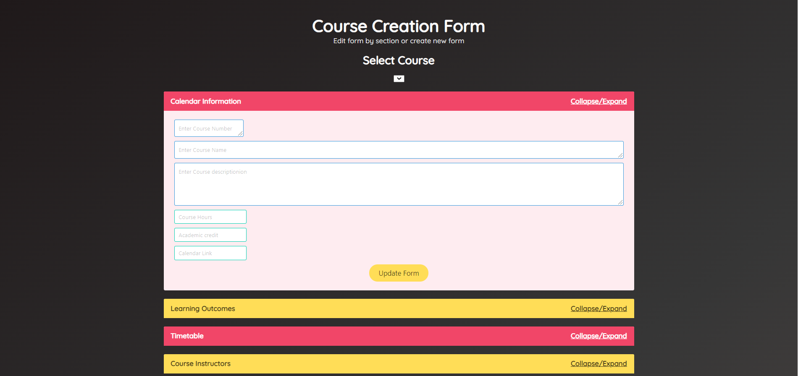

# Course Outline React-Django App

## About

This React-Django web application is designed to view and create university course outlines. The backend serve RESTful requests based on interaction with the React webpage. Dropdown forms can be accessed by interacting with each section. Bulma module was used for various GUI element styling..

## Screen Shots

